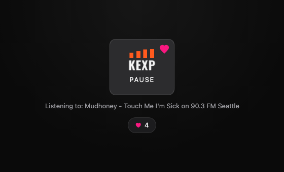
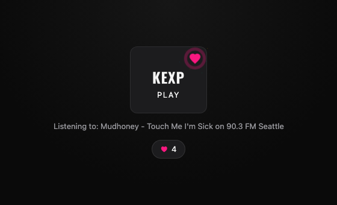
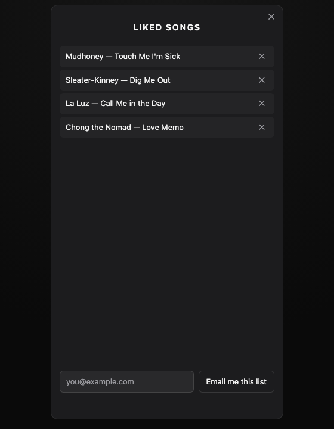

# KEXP, everywhere I go

I love Seattle's [KEXP 90.3 FM](https://kexp.org). I wanted to take it with me — and share it with everyone.

This is a single, dependency-free web component that streams KEXP live, shows what's
playing right now, and lets you ❤️ the songs you don't want to forget. Drop one tag
into any page and you've got the best radio station on earth.

```html
<audio-player></audio-player>
<script type="module" src="./audioPlayer.js"></script>
```

It started after I kept seeing Reddit threads of people struggling to stream KEXP
outside the official site. I reached out to the KEXP team — they kindly gave me
permission to use their API and even pointed me at a better stream source. This
project is a thank-you letter to them. If you use it, [support KEXP](https://kexp.org/donate)
— and send me a link, I'd genuinely love to see where it ends up.

---

## The player



One card. Press it, music plays, the bars dance. The marquee below polls KEXP's
API for the current track and only scrolls when the title actually overflows —
at a constant speed, no matter how long the song name is.

## Like what you hear



The heart sits in the card's corner. Hit it and it double-flips on its X axis
with a motion blur while a ring and confetti burst out — the full Twitter
treatment. Likes persist in `localStorage`, keyed to an anonymous device ID.

Air breaks aren't likeable (the API reports them with no artist/song), so your
playlist never fills up with `undefined — undefined`. Ask me how I know.

## Your playlist, on the flip side



The `♥ 4` chip under the player is both your like counter and a door: click it
and the KEXP card flips over in 3D and expands into a phone-sized panel with
every song you've liked. Remove songs (with an inline *"Remove? Yes / Cancel"* —
no browser popups), or type any email address and send yourself the list.

---

## Using it

```bash
npm install
npm run dev        # http://localhost:5173
```

### Attributes

| Attribute       | Default                                    | What it does                          |
| --------------- | ------------------------------------------ | ------------------------------------- |
| `stream-url`    | `https://kexp.streamguys1.com/kexp160.aac` | Audio stream source                   |
| `volume`        | `0.5`                                      | Playback volume, clamped to `0`–`1`   |
| `poll-interval` | `15000`                                    | Now-playing refresh (ms)              |

### Properties & methods

- `play()` / `pause()` / `toggle()` — playback control
- `toggleLike()` — like/unlike the current song
- `isPlaying`, `isLiked`, `currentPlay` — current state (read-only)
- `playlist` — every liked track as `{ artist, song, airdate, likedAt }`
- `deviceId` — stable anonymous ID for this browser

### Events

| Event             | `detail`                                                   |
| ----------------- | ---------------------------------------------------------- |
| `playing-changed` | `{ isPlaying }`                                            |
| `track-changed`   | `{ artist, song, airdate }`                                |
| `like-changed`    | `{ liked, artist, song, airdate, deviceId, playlistSize }` |
| `player-error`    | `{ message }`                                              |

### Theming

Everything visual is a custom property — restyle it without touching the component:

```css
audio-player {
  --player-accent: #ffb703;   /* equalizer bars, focus rings */
  --player-like: #f91880;     /* the heart */
  --player-radius: 20px;
}
```

Tokens: `--player-bg`, `--player-surface`, `--player-surface-hover`,
`--player-accent`, `--player-like`, `--player-text`, `--player-muted`,
`--player-error`, `--player-radius`.

For structural styling, shadow parts are exposed: `player`, `front`, `back`,
`button`, `button-text`, `logo`, `like`, `menu`, `menu-close`, `display`,
`marquee`, `playlist`, `error`.

```css
audio-player::part(button):hover {
  box-shadow: 0 4px 24px rgb(255 90 30 / 35%);
}
```

---

## How it's built, and why

No framework, no dependencies — one custom element with shadow DOM. That wasn't
minimalism for its own sake: the goal is *KEXP everywhere*, and a zero-dependency
component drops unchanged into a static page, a React app, a browser extension
popup, or a Tauri menu-bar app.

Some decisions worth explaining:

**Render once, mutate surgically.** The DOM is built from a single `<template>`
clone; state changes update `textContent` and attributes. An earlier version
rebuilt everything with `innerHTML` every 15 seconds — which restarted animations
and dropped focus mid-interaction. Never again.

**Constructable Stylesheets.** Styles live in one `CSSStyleSheet` shared by every
instance via `adoptedStyleSheets` — parsed once, not per-player.

**The marquee is a Web Animations API animation, in pixels.** CSS-class marquees
animate in percentages, so long titles scroll faster than short ones. Here the
keyframes are computed from measured widths (`containerWidth → -textWidth`), so
every title travels at the same px/sec. No `void offsetWidth` reflow hacks to
restart it, either — `cancel()` and `animate()` again.

**`container-type: inline-size` on the host.** The component's width follows the
space it's *given*, not its content. Without this, a long song title silently
widens the whole component and the marquee can never detect overflow — a bug the
original version of this project worked around without understanding. Size
containment fixes the cause.

**The heart is a sibling, not a child.** It looks like it's inside the play
button, but nested buttons are invalid HTML and confuse keyboard and screen-reader
users. It's an absolutely-positioned sibling — clicks physically can't reach the
play button underneath.

**The burst centers itself with the CSS `translate` property.** Particle flight
animates `transform`; centering lives on the separate `translate` property, so
they compose instead of overwriting each other. (The first version was 2px
off-center because a border made the ring's box bigger than its `width` — the
margin-offset trick silently broke.)

**The card flip respects people.** The hidden face gets the `inert` attribute —
no ghost tab stops, nothing announced twice. Focus moves to the revealed face.
And everything — bars, marquee, burst, flip — checks `prefers-reduced-motion`
and sits still for users who ask for that.

**Likes are local-first.** `localStorage` plus an anonymous device UUID. No
account, no cookie banner. The `like-changed` event already carries everything a
backend needs, so syncing to a real database is an event listener, not a rewrite.

## Testing

```bash
npm test          # Playwright: chromium + firefox + webkit, auto-starts Vite
npm run test:ui   # interactive mode
```

Fifteen tests run against all three engines on every push, with the KEXP API
fully mocked for determinism. The cross-browser matrix earns its keep: it caught
a Chromium-only launch flag that macOS WebKit silently ignored but Linux WebKit
refused to start with — invisible on my machine, fatal in CI.

## The browser extension

KEXP in your toolbar. The component splits into an **engine** (`playerEngine.js` —
stream, polling, likes; no DOM) and a **shell** (the visual component). On the
web they're fused. In the extension, the engine lives in a Chrome **offscreen
document** so the stream survives the popup closing — the popup is just a
remote control speaking `chrome.runtime` messages, hosting the exact same
`<audio-player>` with a proxy engine injected:

```js
document.querySelector('audio-player').engine = new RemoteEngine(state);
```

Your liked-song count rides along as the toolbar badge.

```bash
npm run build:extension
# then chrome://extensions → Developer mode → Load unpacked → dist-extension/
```

## Where this is going

- **Firefox & Safari** versions of the extension (Firefox: sidebar audio host;
  Safari: `safari-web-extension-converter`)
- **Supabase backend** — global like counts and durable playlists (anonymous,
  per-device — no logins on a radio widget)
- **Song enrichment** — YouTube links for liked tracks, Wikipedia hover cards
  for artists
- **macOS menu-bar app** — Tauri, ~5MB, KEXP in your menu bar
- **Live at** `davidpuerto.com/kexp`

## Thanks

To the KEXP team for saying yes, and for being the kind of station worth
building shrines to. **[Donate to KEXP.](https://kexp.org/donate)**

MIT licensed — take it, embed it, share it.
